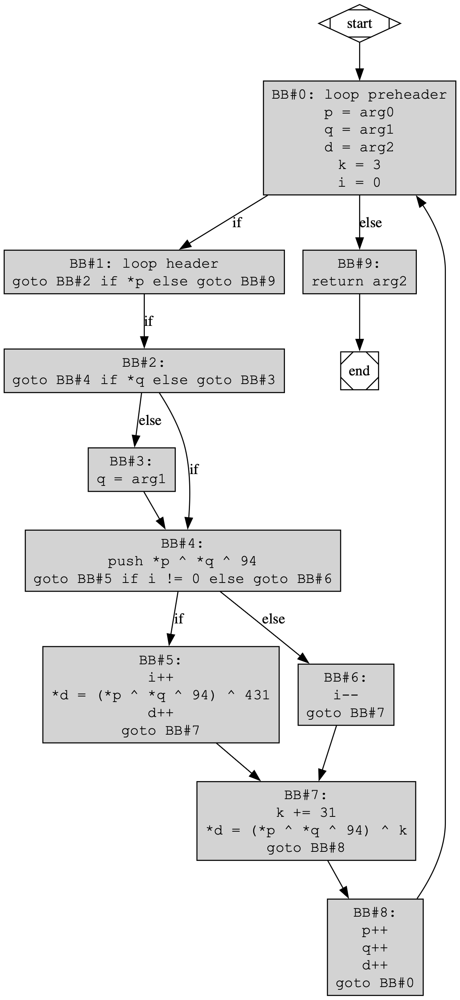
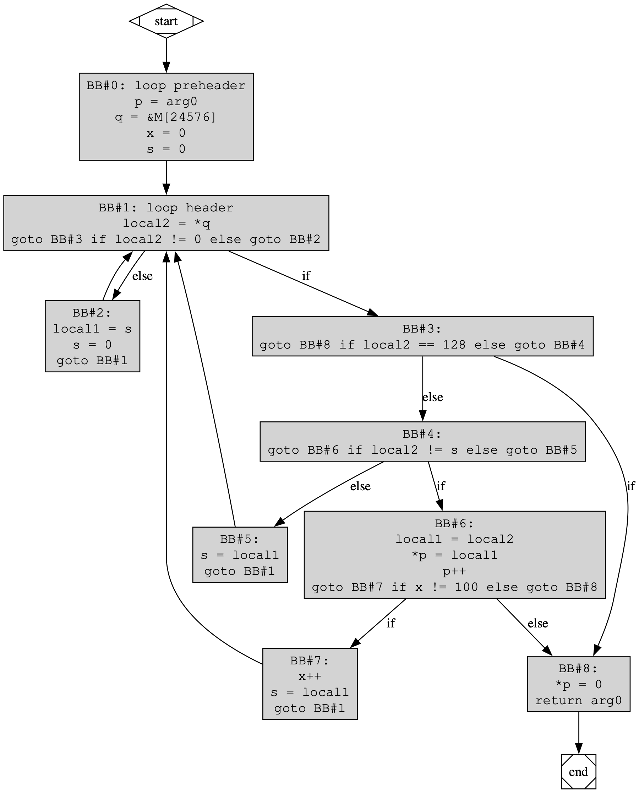
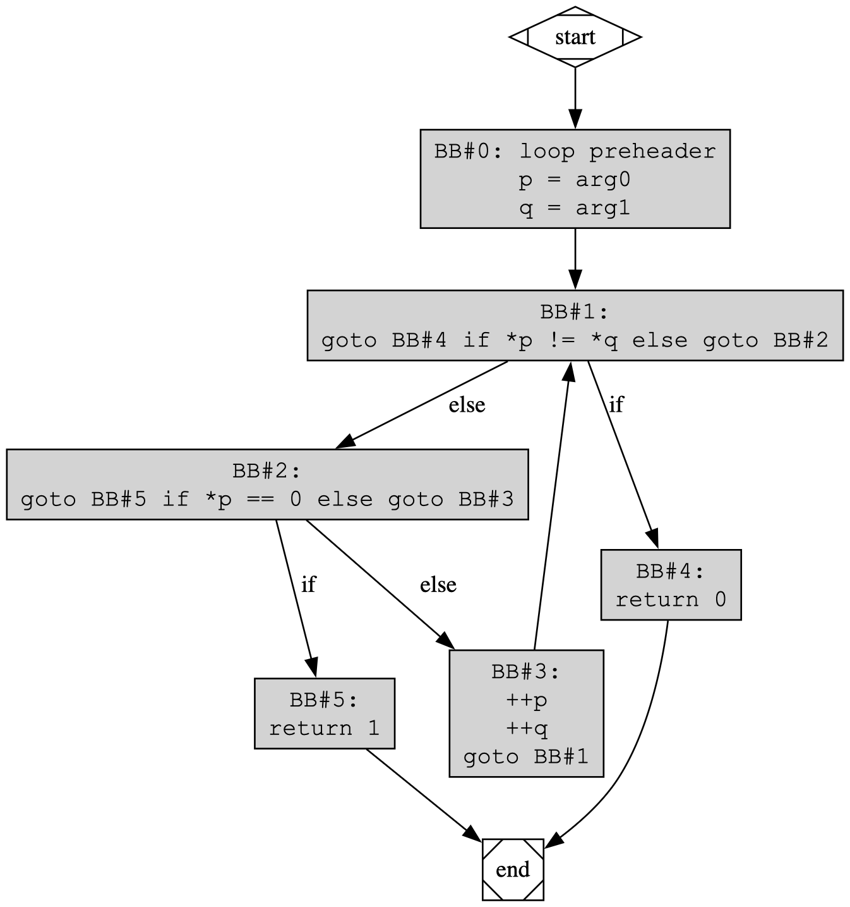

# rev/russian-games (8 solves, 493 points, first blood!)

> My favorite block placing game
>
> The flag format is NOT squ1rrelCTF{} :P (iykyk)

(in retrospect THAT'S SO CLEVER OF A DESCRIPTION)

## Attachments:

[`russian-games.vm`](./russian-games.vm):
```
> file russian-games.vm
russian-games.vm: ASCII text, with CRLF line terminators
```

## The Challenge

In this challenge, we're provided with a `.vm` file, which appears to be some form of programming language. It's not familiar to me, but it doesn't seem to appear on a quick search on esolangs either.

Let's dive in!

## First Impressions

Taking a look at the code format, it seems to be a bytecode-like language. My first instinct tells me it feels Wasm-like. It seems like we have a few simple functions, followed by some very complex ones below. Let's try our hand at understanding the first function:

```
function Main.MMMMN 0
    push argument 0
    push argument 1
    not
    and
    push argument 0
    not
    push argument 1
    and
    or
    return
```

In a stack machine language like the one shown here, we don't have registers like a traditional machine. Instead, we operate based on a working stack of values, which allow us to perform computations in postfix order. We can simulate the stack in this program to understand what it does:

```
(takes two arguments, a and b)

push a to the stack
stack = [ a ]

push b to the stack
stack = [ a , b ]

bitwise? not top of the stack
stack = [ a , ~b ]

bitwise and the two operands together
stack = [ a & ~b ]

push a to the stack
stack = [ a & ~b , a ]

bitwise not top of the stack
stack = [ a & ~b , ~a ]

push b to the stack
stack = [ a & ~b , ~a , b ]

bitwise and the two operands together
stack = [ a & ~b , ~a & b ]

bitwise or the two operands together
stack = [ (a & ~b) | (~a & b) ]

return (a & ~b) | (~a & b)
```

This expression is equivalent to `a ^ b`! It seems like our language doesn't have an `xor` primitive (or they want to make us suffer).

Okay, we have a few more short functions. Let's reverse those too.

```
function Main.MMMMM 1
    push argument 1
    pop local 0
    push argument 1
    neg
    push constant 1
    sub
    push argument 0
    and
    pop local 0
    push argument 1
    push argument 0
    not
    and
    push local 0
    or
    return
```

Here, we introduce local variables, which allow us to work around the stack's LIFO order by saving values in temporary registers. This is a pretty common setup for stack machines, and the number of locals can depend on the language. Here, it seems like we're only using one local. We can pop

Additionally, we also see `push constant`. This probably just pushes a constant value.

```
(takes two arguments, a and b)

push b
stack = [ b ]

pop local 0
stack = [ ]
local 0 = b

push argument 1
stack = [ b ]
local 0 = b

negate top operand
stack = [ -b ]
local 0 = b

push constant 1
stack = [ -b , 1 ]
local 0 = b

subtract*
stack = [ -b - 1 ]
local 0 = b

push a
stack = [ -b-1 , a ]
local 0 = b

and
stack = [ (-b-1) & a ]
local 0 = b

pop local 0
stack = [ ]
local 0 = (-b-1) & a

push b
stack = [ b ]
local 0 = (-b-1) & a

push a
stack = [ b , a ]
local 0 = (-b-1) & a

not
stack = [ b , ~a ]
local 0 = (-b-1) & a

and
stack = [ b & ~a ]
local 0 = (-b-1) & a

push local 0
stack = [ b & ~a , (-b-1) & a ]
local 0 = (-b-1) & a

or
stack = [ (b & ~a) | ((-b-1) & a) ]
local 0 = (-b-1) & a

return (b & ~a) | ((-b-1) & a)

```

\*: how do we know that the subtraction is `-b - 1` and not `1 - (-b)`? this was just an educated guess I made here based on how most other stack-based languages handle order of operands.

This final result looks nasty, but there is one trick we can use. Remember that when we use two's complement, `-b = ~b + 1`. Thus, `-b - 1` = `~b`, and we get... `(b & ~a) | (~b & a)`.

XOR again!

Okay, surely we have enough XOR primiti-

```
function Main.MMMNM 2
    push argument 0         # stack = [ a ]
    push argument 1         # stack = [ b ]
    not                     # stack = [ a , ~b ]
    pop local 0             # stack = [ a ]         l0 = ~b
    not                     # stack = [ ~a ]        l0 = ~b
    push argument 1         # stack = [ ~a , b ]    l0 = ~b
    and                     # stack = [ ~a&b ]      l0 = ~b
    pop local 1             # stack = [ ]           l0 = ~b , l1 = ~a&b
    push local 0            # stack = [ ~b ]        l0 = ~b , l1 = ~a&b
    push argument 0         # stack = [ ~b , a ]    l0 = ~b , l1 = ~a&b
    and                     # stack = [ ~b&a ]      l0 = ~b , l1 = ~a&b
    pop local 0             # stack = [ ]           l0 = ~b&a , l1 = ~a&b
    push local 1            # stack = [ ~a&b ]
    push local 0            # stack = [ ~a&b , ~b&a ]
    or                      # stack = [ a^b ]
    return
```


**Okay, _now_ we have enough XOR primitives**

```
function Main.MMNMM 0
    push argument 0         # stack = [ a ]
    push argument 1         # stack = [ a , b ]
    not                     # stack = [ a , ~b ]
    and                     # stack = [ a&~b ]
    push argument 0         # stack = [ a&~b , a ]
    not                     # stack = [ a&~b , ~a ]
    push argument 1         # stack = [ a&~b , ~a , b ]
    and                     # stack = [ a&~b , ~a&b ]
    or                      # stack = [ a^b ]
    push constant 0         # stack = [ a^b , 0 ]
    return                  # return 0

function Main.MMNMN 1
    push argument 0         # stack = [ a ]
    push argument 1         # stack = [ a , b ]
    push argument 0         # stack = [ a , b , a ]
    not                     # stack = [ a , b , ~a ]
    and                     # stack = [ a , b&~a ]
    push argument 1         # stack = [ a , b&~a , b ]
    not                     # stack = [ a , b&~a , ~b ]
    push argument 0         # stack = [ a , b&~a , ~b , a ]
    and                     # stack = [ a , b&~a , ~b&a ]
    or                      # stack = [ a , a^b ]
    pop local 0             # stack = [ a ]
    return                  # return a
```

Looks like we have the most complicated way to return `0` and the first argument,
respectively.

Next, we have a function that seems to handle a lot of character values. We also
see a "that"... pointer? Let's decode the ASCII character values (if you see
values between ~90 and ~120, it likely is ASCII lowercase).

```
function Main.NMNNM 0
    push argument 0
    pop pointer 1
    push constant 110
    pop that 0
    push constant 97
    pop that 1
    push constant 110
    pop that 2
    push constant 100
    pop that 3
    push constant 50
    pop that 4
    push constant 116
    pop that 5
    push constant 101
    pop that 6
    push constant 116
    pop that 7
    push constant 114
    pop that 8
    push constant 111
    pop that 9
    push constant 115
    pop that 10
    push constant 0
    pop that 11
    push argument 0
    return
```

```python
>>> bytes([110,97,110,100,50,116,101,116,114,111,115])
b'nand2tetros'
```

After a bunch of searching, it seems that this code is actually the nand2tetris
VM bytecode!

([nand2tetris](https://www.nand2tetris.org) is a program which teaches people
concepts from computer architecture all the way to operating systems! it's very
neat! (#notsponsored, just my personal opinion))

After looking around a bit in their resources, we see that we can use `push/pop pointer` to manipulate the values of `this` and `that`, which are two pointer variables. We can then use
`push/pop this/that` to work with those pointers. Here, it seems we write the
string `nand2tetros` to the pointer passed in.

## a few minutes of reading the docs later

## The Big Functions

O_o

```
function Main.MMMNN 5
    push argument 0
    pop pointer 0
    push argument 1
    pop pointer 1
    push argument 2
    pop local 1
    push constant 3
    pop local 2
    goto _____
    
    label _____
    push this 0
    if-goto ____
    goto .

    label ____
    push that 0
    if-goto ___
    goto ______

    label ______
    push argument 1
    pop pointer 1

    label ___
    push this 0
    push that 0
    call Main.MMMMN 2
    push constant 94
    call Main.MMMNM 2
    push constant 132
    call Main.MMNMN 2

    push local 3
    if-goto __
    goto .__

    label _
    push local 2
    push constant 31
    add
    pop local 2
    push local 2
    call Main.MMMMM 2
    push pointer 1
    pop local 0
    push local 1
    pop pointer 1
    pop that 0
    goto .__.

    label .__.
    push pointer 0
    push constant 1
    add
    pop pointer 0
    push pointer 1
    push constant 1
    add
    pop local 1
    push local 0
    push constant 1
    add
    pop local 0
    push local 0
    pop pointer 1
    goto _____

    label .
    push argument 2
    return

    label __
    push local 3
    push constant 1
    add
    pop local 3
    push pointer 1
    pop local 0
    push local 1
    pop pointer 1
    pop local 4
    push local 4
    push local 1
    call Main.MMMMM 2
    push local 1
    call Main.MMMMM 2
    push constant 431
    call Main.MMMNM 2
    pop that 0
    push pointer 1
    push constant 1
    add
    pop local 1
    push local 0
    pop pointer 1
    push local 4
    goto _

    label .__
    push local 3
    push constant 1
    sub
    pop local 3
    goto _
```

One thing I realized here is this is actually really easy to break up into basic
blocks. Basic blocks are a compilers concept, which represent code that must all
execute, or not execute, together. Thus, we can't have any control flow branches
within a basic block. This lets us break up the code into a few of these, and
reorder them to make more sense:

```
function Main.MMMNN 5
    [BB#0: loop preheader]
    push argument 0
    pop pointer 0
    push argument 1
    pop pointer 1
    push argument 2
    pop local 1
    push constant 3
    pop local 2
    goto _____ (BB#1)
    
    [BB#1: loop header]
    label _____
    push this 0
    if-goto ____ (BB#2)
    goto . (BB#9)

    [BB#2: 1->if]
    label ____
    push that 0
    if-goto ___ (BB#4)
    goto ______ (BB#3)

    [BB#3: 2->else]
    label ______
    push argument 1
    pop pointer 1
    (fallthrough to ___ (BB#4))

    [BB#4: post 2-if]
    label ___
    push this 0
    push that 0
    call Main.MMMMN 2
    push constant 94
    call Main.MMMNM 2
    push constant 132
    call Main.MMNMN 2

    push local 3
    if-goto __ (BB#5)
    goto .__ (BB#6)

    [BB#5: 4->if]
    label __
    push local 3
    push constant 1
    add
    pop local 3
    push pointer 1
    pop local 0
    push local 1
    pop pointer 1
    pop local 4
    push local 4
    push local 1
    call Main.MMMMM 2
    push local 1
    call Main.MMMMM 2
    push constant 431
    call Main.MMMNM 2
    pop that 0
    push pointer 1
    push constant 1
    add
    pop local 1
    push local 0
    pop pointer 1
    push local 4
    goto _ (BB#7)

    [BB#6: 4->else]
    label .__
    push local 3
    push constant 1
    sub
    pop local 3
    goto _ (BB#7)

    [BB#7: post-4->if/else] 
    label _
    push local 2
    push constant 31
    add
    pop local 2
    push local 2
    call Main.MMMMM 2
    push pointer 1
    pop local 0
    push local 1
    pop pointer 1
    pop that 0
    goto .__. (BB#8)

    [BB#8: post-7]
    label .__.
    push pointer 0
    push constant 1
    add
    pop pointer 0
    push pointer 1
    push constant 1
    add
    pop local 1
    push local 0
    push constant 1
    add
    pop local 0
    push local 0
    pop pointer 1
    goto _____ (BB#1)

    [BB#9: exit]
    label .
    push argument 2
    return
```

Now, we can analyze each of these basic blocks independently.

```
function Main.MMMNN 5
    [BB#0: loop preheader]
    push argument 0
    pop pointer 0
    push argument 1
    pop pointer 1
    push argument 2
    pop local 1
    push constant 3
    pop local 2
    goto _____ (BB#1)
```

Here, we take our arguments and put them into locals. It seems that the function
takes two pointers (in arguments 0 and 1), and a value in argument 2 which is stored
to local 1. We also store `3` to local 2.

We'll denote the function signature as `MMMNN(p, q, d)`. Right now, we have

```
this = p
that = q
local 1 = d
local 2 = 3
```

```
    [BB#1: loop header]
    label _____
    push this 0
    if-goto ____ (BB#2)
    goto . (BB#9)
```

This is our loop header: the first thing we encounter when we start the loop.
`push this 0` pushes `*p` to the stack, and we go to BB#2 if the value is not
zero. Otherwise, we go to BB#9.

```
    [BB#2: 1->if]
    label ____
    push that 0
    if-goto ___ (BB#4)
    goto ______ (BB#3)
```

This is an if statement within our loop, we read `*q` and go to BB#4 if the value
is not zero. Otherwise, we go to BB#3.

```
    [BB#3: 2->else]
    label ______
    push argument 1
    pop pointer 1
    (fallthrough to ___ (BB#4))
```

This is one arm of `BB#2`'s conditional: we set `that` back to the original value
of `q`. Combined with the logic in `BB#2`, it seems like we reset back to the
original value if `*q` is 0.

```
    [BB#4: post 2-if]
    label ___
    push this 0
    push that 0
    call Main.MMMMN 2
    push constant 94
    call Main.MMMNM 2
    push constant 132
    call Main.MMNMN 2

    push local 3
    if-goto __ (BB#5)
    goto .__ (BB#6)
```

Here, we push both `*p` and `*q` to the stack, and call a few functions. We can
rewrite this as:
```
    [BB#4: post 2-if]
    label ___
    push this 0
    push that 0
    call XOR
    push constant 94
    call XOR
    push constant 132
    call (return first arg)

    push local 3
    if-goto __ (BB#5)
    goto .__ (BB#6)
```

from our reverse engineering previously. Thus, we see that this calculates
`*p ^ *q * 94`, and additionally pushes the value of `local 3`. So far, we haven't
set the value, so it will default to 0.

```
    [BB#5: 4->if]
    label __
    push local 3
    push constant 1
    add
    pop local 3
    push pointer 1
    pop local 0
    push local 1
    pop pointer 1
    pop local 4
    push local 4
    push local 1
    call Main.MMMMM 2
    push local 1
    call Main.MMMMM 2
    push constant 431
    call Main.MMMNM 2
    pop that 0
    push pointer 1
    push constant 1
    add
    pop local 1
    push local 0
    pop pointer 1
    push local 4
    goto _ (BB#7)
```

This basic block is a bit more complicated. We can break it up into logical operations, though.

```
    [BB#5: 4->if]
    label __

    // add one to local 3
    push local 3
    push constant 1
    add
    pop local 3

    // local 0 = that
    push pointer 1
    pop local 0

    // that = d
    push local 1
    pop pointer 1

    // local 4 = top of stack (*p ^ *q ^ 94 from before)
    pop local 4
    push local 4

    // XOR with local 1 twice, does nothing
    push local 1
    call XOR
    push local 1
    call XOR

    // XOR with 431
    push constant 431
    call XOR

    // *d = (*p ^ *q ^ 94) ^ 431
    pop that 0

    // d = d + 1
    push pointer 1
    push constant 1
    add
    pop local 1

    // that = local 0
    push local 0
    pop pointer 1

    // re-push *p ^ *q ^ 94
    push local 4
    goto _ (BB#7)
```

Here, we have a lot of operations which just perform shuffling between `that` and
`d`, so that we can write to `*d`. The overall sequence of operations is:

```
local 3 += 1
*d = (*p ^ *q ^ 94) ^ 431
d++
```

```
    [BB#6: 4->else]
    label .__
    push local 3
    push constant 1
    sub
    pop local 3
    goto _ (BB#7)
```

A nice, short basic block. Here, we decrement local 3 by 1, and move on. Thus, it
seems that local 3 alternates between 0 and 1.

```
    [BB#7: post-4->if/else] 
    label _

    // local2 += 31
    push local 2
    push constant 31
    add
    pop local 2

    // (*p ^ *q ^ 94) ^ local2
    push local 2
    call XOR 2

    // local0 = that
    push pointer 1
    pop local 0

    // that = d
    push local 1
    pop pointer 1

    // *d = (*p ^ *q ^ 94) ^ local2
    pop that 0
    goto .__. (BB#8)
```

Our control flow rejoins here, and we add `31` to `local2` before XORing that with
the top of our stack. Then, we write this to `*d`.

```
    [BB#8: post-7]
    label .__.

    // this++
    push pointer 0
    push constant 1
    add
    pop pointer 0

    // d = d + 1
    push pointer 1
    push constant 1
    add
    pop local 1

    // compute q + 1
    push local 0
    push constant 1
    add
    pop local 0

    // q += 1
    push local 0
    pop pointer 1

    goto _____ (BB#1)
```

Finally, we have a block just dedicated to incrementing our pointers and shuffling
`d` back into `local1`. We then re-enter the loop.

```
    [BB#9: exit]
    label .
    push argument 2
    return
```

Finally, one last basic block: we push the original value `d` (in argument 2) and
return it.

Our final control flow graph looks like:



Now that we understand this, we can see a bit of how we transform the flag:

- We have a hardcoded key, which is the value `nand2tetros`. We XOR each element
of the flag with this key and with 94, starting back over if we run out of key characters.
- After this, we XOR with `34 + 31*i` for index `i` of the flag.
- Every other iteration, we will also write `flagchar ^ keychar ^ 94 ^ 431` to
the destination buffer. We probably can ignore these.

## So what?

Let's take a look at our next function:

```
function Main.NNMNM 3
    [BB#0: loop preheader]
    // p = arg0
    push argument 0
    pop pointer 0
    
    // q = &M[24576]
    push constant 24576
    pop pointer 1

    // x = 0
    push constant 0
    pop local 0

    // s = 0
    push constant 0
    goto ___ (BB#1)

    [BB#1: loop header]
    label ___
    // local2 = *q
    push that 0
    pop local 2
    push local 2
    if-goto ____ (BB#3)
    (fallthrough to BB#2)

    [BB#2: 1->else]
    pop local 1
    push constant 0
    goto ___ (BB#1)

    [BB#3: 1->if]
    label ____

    // goto BB#8 if local2 == 128 else goto BB#4
    push local 2
    push constant 128
    eq
    if-goto _____ (BB#8)
    (fallthrough to BB#4)

    [BB#4: 2->else]
    // goto BB#6 if local2 != s else goto BB#5
    push local 2
    eq
    not
    if-goto DIF (BB#6)
    (fallthrough to BB#5)

    [BB#5: 3->else]
    s = local1
    push local 1
    goto ___ (BB#1)

    [BB#6:]
    label DIF

    // local1 = local2 (= *q)
    push local 2
    pop local 1

    // *p = *q by transitvity
    push local 1
    pop this 0

    // p++
    push pointer 0
    push constant 1
    add
    pop pointer 0

    // goto BB#7 if x != 100 else goto BB#8
    push local 0
    push constant 100
    eq
    not
    if-goto ______ (BB#7)
    goto _____ (BB#8)

    [BB#7:]
    label ______
    // x++
    push local 0
    push constant 1
    add
    pop local 0
    
    // s = local1
    push local 1
    goto ___  (BB#1)

    [BB#8:]
    label _____
    // *p = 0
    push constant 0
    pop this 0
    // return arg0
    push argument 0
    return
```

A lot shorter this time, luckily. We can perform the same basic block analysis, which I've
annotated above. Notice that this time, we have a value that is on the stack during the loop,
which I'll denote as `s`. I'm also being a bit pedantic and breaking up basic blocks where
a traditional compiler would break them up.

The CFG is:



Here, we can see that we're copying up to 100 bytes from `&M[24576]`, and stopping
if we ever encounter a null byte. Thus, we're likely working with C string-style strings.

If we look at the bottom of our file, we can start to see how things come together:

```
function Sys.init 0
    push constant 2048
    call LOAD_FROM_24576
    push constant 4096
    call LOAD_KEY
    push constant 10240
    call XOR_WITH_KEY
    push constant 8192
    call Main.NNMNN 1
    call Main.NNNNN 2
```

Two functions left!

## The Good News:

One of the functions just loads a bunch of values!

```
function Main.NNMNN 0
    push argument 0
    pop pointer 0
    push constant 97
    pop this 0
    push constant 481
    pop this 1
    push constant 15
    pop this 2
    push constant 37
    pop this 3

    ...

    push constant 445
    pop this 43
    push constant 951
    pop this 44
    push constant 969
    pop this 45
    push constant 483
    pop this 46
    push constant 943
    pop this 47
    push argument 0
    return
```

## The Last Function:

This one is really short; I'll annotate it inline as well.

```
function Main.NNNNN 0
    [BB#0: loop preheader]
    // p = arg0
    push argument 0
    pop pointer 0
    // q = arg1
    push argument 1
    pop pointer 1
    (fallthrough to BB#1)

    [BB#1: loop header]
    label ___
    push this 0
    push that 0
    eq
    not
    // goto BB#4 if *p != *q else goto BB#2
    if-goto ____ (BB#4)
    (fallthrough to BB#2)

    [BB#2]
    push this 0
    push constant 0
    eq
    // goto BB#5 if *p == 0 else goto BB#3
    if-goto _____ (BB#5)
    (fallthrough to BB#3)

    [BB#3]
    // p++
    push pointer 0
    push constant 1
    add
    pop pointer 0

    // q++
    push pointer 1
    push constant 1
    add
    pop pointer 1
    goto ___ (BB#1)

    [BB#4: return 0]
    label ____
    push constant 0
    return

    [BB#5: return 1]
    label _____
    push constant 0
    push constant 0
    eq
    return
```



With a bit of looking, we recognize this as a simple `strcmp`! Thus, our final
program is:

```
function Sys.init 0
    push constant 2048
    call LOAD_FROM_24576
    push constant 4096
    call LOAD_KEY 1
    push constant 10240
    call XOR_WITH_KEY
    push constant 8192
    call GET_TARGET
    call STRCMP
```

## Can we finally get out of this language?

YES!

Now that we understand the program, it's a simple matter of reversing it. I chose
to use Python for this:

```python
target = [97, 481, 15, 37, 420, 116, 128, 503, 229, 130, 489, 189, 333, 496, 358, 321, 497, 297, 461, 429, 439, 410, 496, 428, 588, 486, 632, 587, 496, 560, 736, 468, 726, 689, 463, 651, 779, 486, 864, 891, 482, 810, 975, 445, 951, 969, 483, 943]
key = [110, 97, 110, 100, 50, 116, 101, 116, 114, 111, 115]

# skip the extra number we get every other iteration
actual = [[target[i], target[i+2]] for i in range(0, len(target), 3)]
actual = [a for r in actual for a in r]

# XOR *p ^ *q ^ 94
pre_sub = [a^b^94 for a,b in zip(actual, key*4)]

# XOR with 34 * 31i
flag = [pre_sub[i] ^ (34+31*i) for i in range(len(pre_sub))]
print(''.join([chr(x) for x in flag]))

# squ1rrel{n4nd2t3tr1s_VM_1s_gr8!}
```

## The Description

> My favorite block placing game

- Tetris blocks?
- Basic blocks?
- Hardware blocks?

:P

thanks for the challenge <3
